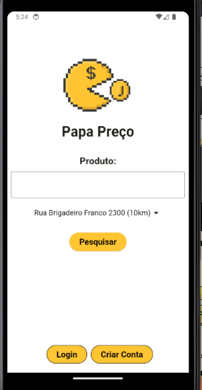
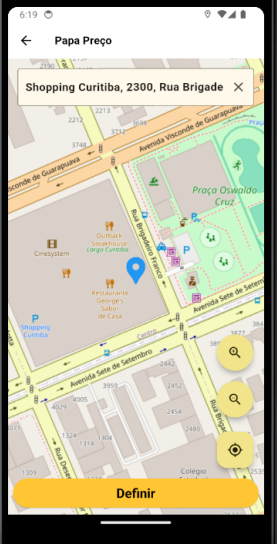
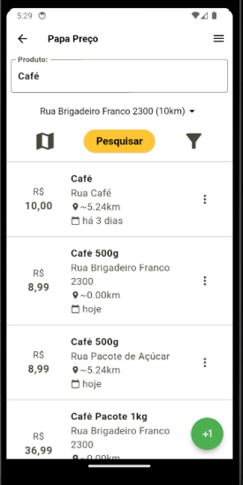

# Papapreco 📊

**PapaPreco** is a **Flutter** mobile application designed for collaborative price comparison. Users can manually add product prices or scan NFC-e QR codes to input items automatically. The app supports searching by product name, price range, or location, allowing consumers to make more informed purchasing decisions.

---

## ✨ Key Features

- **QR Code Scanning**: Scan NFC-e receipts to extract product details and prices  
- **Manual Entry**: Input product information manually (name, price, store, etc.)  
- **Search & Compare**: Search products by name, filter by price range or store  
- **Collaborative Database**: Aggregates price data from multiple users for better coverage  
- **Intuitive UI**: Designed for a smooth and straightforward user experience

---

## 🛠️ Technology Stack

| Component        | Technology                                  |
|------------------|---------------------------------------------|
| **Frontend**     | Flutter                                     |
| **Backend**       | [API](https://github.com/Juniorrek/papaprecoapi) (Java/Spring) |
| **Platform**      | Android (iOS compatibility planned)         |
| **Storage**       | PostgreSQL |

---

### Home Screen


### Map view


### Searched Items


---

## 🔗 Backend Dependency

This project **requires the backend service** available at:

👉 [https://github.com/Juniorrek/papaprecoapi](https://github.com/Juniorrek/papaprecoapi)

The backend handles product storage, search functionality, and NFC-e data parsing. Make sure the API is running and accessible (locally or remotely) for the mobile app to function correctly.


## 🚀 Getting Started

Follow these steps to run the app locally:

### Prerequisites

- Flutter SDK
- Android Studio or VS Code with Flutter and Dart plugins  
- Android emulator or connected device  

### Installation

```bash
git clone https://github.com/Juniorrek/papapreco.git
cd papapreco
flutter pub get
flutter run
```

### Configuration

The app has no environment settings committed to source. Everything environment-specific
is passed at build time with `--dart-define`:

| Define | Default | Purpose |
|---|---|---|
| `API_BASE_URL` | `http://10.0.2.2:8080/papaprecoapi` | Base URL of the backend, **including the scheme and the API's context path**. The default is the Android emulator's alias for the host machine, so a bare `flutter run` targets a locally running API. |
| `DEV_QRCODE_URL` | *(empty)* | Optional NFC-e URL used to pre-fill the "insert QR code" field during development, so you don't have to scan a real receipt on every run. Empty means no pre-fill. |

```bash
# Physical device on the same LAN as the API (use your machine's LAN address)
flutter run --dart-define=API_BASE_URL=http://192.168.0.10:8080/papaprecoapi

# Deployed environment
flutter build apk --dart-define=API_BASE_URL=https://api.example.com
```

Because these are compile-time constants, changing one requires a rebuild — a hot
restart will not pick it up.

---

## 🗺️ Roadmap

The engineering roadmap — infrastructure, testing strategy, and the reasoning
behind each decision — is tracked in [docs/ROADMAP.md](docs/ROADMAP.md).

---

## 🧭 Maintenance / Next Steps

The Android toolchain was bumped (2026-07) to Gradle 8.14 / AGP 8.11.1 / Kotlin 2.2.20 so the
project builds against current Flutter SDKs. A few follow-ups to keep in mind:

- **Migrate to Flutter's Built-in Kotlin.** `flutter run`/`flutter build` currently warn that
  applying the Kotlin Gradle Plugin directly (as `android/app/build.gradle` and the
  `mobile_scanner` plugin do) will stop working in a future Flutter release. We can't finish this
  migration until `mobile_scanner` (and any other plugin that still applies KGP itself) ships a
  version that supports Built-in Kotlin — check its changelog before attempting. See the
  [migration guide](https://docs.flutter.dev/release/breaking-changes/migrate-to-built-in-kotlin/for-app-developers).
- **Keep an eye on `flutter_compass`.** It's a transitive dependency (via
  `flutter_map_location_marker` → `location_picker_flutter_map`) and is lightly maintained. If the
  location-picker/compass features start breaking, check whether a newer release exists or whether
  it needs to be swapped for an alternative.
- **Several direct dependencies have pending major upgrades** (`firebase_core`,
  `firebase_messaging`, `flutter_local_notifications`, `geolocator`, `google_sign_in`,
  `flutter_map`, `location_picker_flutter_map`, `mobile_scanner` 7.x). Run
  `flutter pub outdated` to see the current gaps — these were intentionally left on their locked
  minor/patch versions for now since major bumps usually carry breaking API changes that need
  dedicated testing.
