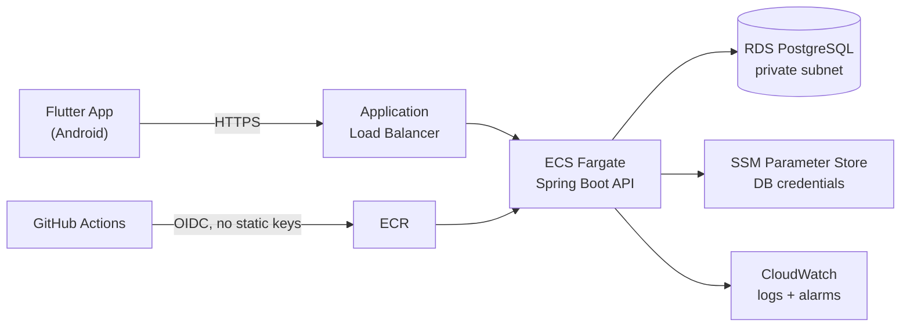

# PapaPreco — Engineering Roadmap

This document tracks the evolution of PapaPreco from a working prototype into a
production-deployed system. Each item states **what**, **why**, and a rough
effort estimate, so the reasoning behind the ordering is auditable — not just
the outcome.

**Status legend:** `[ ]` todo · `[~]` in progress · `[x]` done · `[-]` deliberately skipped

**Ordering principle:** unblock first → highest-variance work next (unknown
unknowns need slack) → predictable work → presentation last.

---

## Phase 0 — Make it deployable

Blockers. Nothing downstream can start until these are done.

- [x] **Externalize API configuration** — ~2h
  Replaced the `Configs.status` enum and hardcoded LAN IPs in `lib/rest/api.dart`
  with a single `--dart-define=API_BASE_URL=...`, which carries the scheme and
  the API's context path so pointing at an HTTPS deployment is a build argument
  rather than a code change. `API.uri(path, [query])` is now the only way call
  sites build a URL. The `pc`/`cel` branches went away with the enum: the QR
  pre-fill became `--dart-define=DEV_QRCODE_URL`, and `MapProvider` now falls
  back to the default coordinates whenever geolocation is unavailable instead of
  asking which machine it is running on.
  *Why:* a home-network IP committed to source control is the least defensible
  file in the repository, and no deploy is possible while the base URL is fixed
  at compile time.

- [x] **Delete or rewrite `test/widget_test.dart`** — ~15min
  The file contained the Flutter counter template and asserted on widgets that
  did not exist. Deleted, and replaced with `test/rest/api_test.dart` covering
  URL resolution and query/path escaping — `flutter test` would otherwise fail
  on an empty suite.
  *Why:* a red test suite is strictly worse than no test suite.

- [x] **Rotate the API's committed credentials and externalize its config** — ~3h
  Not in the original plan; found while starting the Docker work. Three live
  secrets were committed to `papaprecoapi`, which is a public repository: the
  Gmail app password in `application.yaml`, the RSA private key signing every
  JWT, and a `firebase-adminsdk` **service account** key — a server-side admin
  credential for the whole Firebase project, which is a different thing from
  the `google-services.json` client config discussed in Phase 4. All three were
  rotated and the old ones revoked at the provider, then moved to a gitignored
  `secrets/` directory and read through `${...}` placeholders; `.env.example`
  documents the variable list. `SecurityConfig` was reading its keys via
  `@Value("jwt.rsa.pub")` with no `${}`, so the JWT properties in
  `application.yaml` were dead config and no override could have worked. Log
  levels dropped from `TRACE` to `INFO` defaults — `BasicBinder: TRACE` prints
  bound SQL parameters, meaning password hashes and verification codes.
  *Why:* rotation is the only real fix once a secret is pushed, and the roadmap
  already ruled history rewriting out of scope. Nothing could be deployed
  before this: an image built from the old tree would have baked the keys into
  a layer, and there was no way to supply a different database or mail account
  per environment.

- [ ] **Dockerize the API** — ~3h
  Multi-stage build, slim JRE base, non-root user, `HEALTHCHECK` instruction.
  *Why:* prerequisite for ECR/Fargate, and it makes the build reproducible.

- [ ] **`docker-compose.yml` for local development** — ~1h
  API + PostgreSQL, seeded, one command to start.
  *Why:* a reviewer who cannot run the project will not evaluate the project.

- [ ] **Versioned database migrations (Flyway or Liquibase)** — ~2h
  *Why:* schema-as-code is assumed at senior level; hand-applied DDL is not.

---

## Phase 1 — Deploy to AWS

Highest-variance phase. Scheduled early on purpose: IAM, VPC and networking
failures are unpredictable for a first-time AWS user, and this is where the
schedule needs slack.

Target architecture:

- [ ] **AWS Budget alarm at USD 20 — before creating any other resource** — ~15min
  *Why:* the single cheapest insurance policy in this document.

- [ ] **Terraform: VPC, subnets, security groups** — ~5h
  Fargate tasks in **public subnets** with a restrictive security group.
  *Why:* a NAT Gateway costs ~USD 32/month and buys nothing at this scale. This
  is a deliberate cost/security trade-off — see the corresponding ADR.

- [ ] **Terraform: ECR + ECS Fargate service + ALB with ACM certificate** — ~8h
- [ ] **Terraform: RDS PostgreSQL (t4g.micro, private subnet)** — ~3h
- [ ] **Credentials in SSM Parameter Store** — ~1h
  *Why:* cheaper than Secrets Manager and sufficient without rotation needs.
- [ ] **Route 53 + custom domain** — ~2h
- [ ] **GitHub Actions → AWS via OIDC** — ~2h
  *Why:* no long-lived access keys in repository secrets. Worth being able to
  explain in a security interview.
- [ ] **Publish Terraform in a public `papapreco-infra` repository** — ~1h
  *Why:* infrastructure-as-code is what recruiters actually search for.

### Cost guardrails

| Resource | Monthly cost | Note |
|---|---|---|
| NAT Gateway | ~USD 32 | **Avoided by design** |
| ALB | ~USD 16–18 | Unavoidable for HTTPS + custom domain |
| Fargate (1 small task) | ~USD 10 | |
| RDS t4g.micro | USD 0 | Free tier, 12 months; ~USD 13 after |
| **Total** | **~USD 25–30** | `terraform destroy` when not job-hunting |

---

## Phase 2 — CI and tests

Predictable, low-variance work. Expands or contracts to fill remaining time.

- [ ] **GitHub Actions on both repositories** — ~4h
  `analyze` + `test` + `build`, enforced as a required check on pull requests.

- [ ] **API: JUnit + Testcontainers against real PostgreSQL** — ~6h
  *Why:* testing repositories against a real database instead of mocks is a
  strong seniority signal and catches the bugs mocks hide.

- [ ] **Flutter: unit tests for the NFC-e parser and repositories** — ~6h
  *Why:* the NFC-e parser is the most complex and highest-risk logic in the
  codebase. Coverage percentage is not the goal — covering the hard parts is.

- [ ] **Widget tests for 3–4 critical screens** — ~4h

- [ ] **Selective refactor for testability (2–3 files maximum)** — ~4h
  Extract logic out of `detalhe_produto_page.dart` (590 lines) and
  `alertas_usuario_page.dart` (470 lines) only where it unlocks a test.
  *Why:* refactoring for aesthetics alone is not worth the time right now.

---

## Phase 3 — Presentation

- [ ] **Rewrite README in English** — ~3h
  30-second demo GIF, Mermaid architecture diagram, live demo link, CI badges.

- [ ] **Architecture Decision Records in `docs/adr/`** — ~3h
  Minimum set:
  1. Why Flutter over native
  2. Why ECS Fargate over Lambda or EKS
  3. Public subnets over NAT Gateway (cost/security trade-off)
  4. Portuguese domain terms as ubiquitous language, English everywhere else
  *Why:* seniority is assessed on documented trade-offs, not on technology
  choices. Highest signal-per-hour item in this roadmap.

- [ ] **Distributable demo** — ~3h
  APK on GitHub Releases + short video. Recruiters do not install APKs; the
  video is what actually gets watched.

- [ ] **Conventional commits in English from this point forward** — ongoing
- [-] **Rewrite existing git history** — *skipped:* cost outweighs benefit.

---

## Phase 4 — Differentiators (post-MVP)

This is what separates the project from every other CRUD-on-AWS portfolio. Not
part of the initial sprint.

- [ ] **Asynchronous NFC-e processing via SQS** — ~20h
  App submits the receipt URL → API enqueues to SQS → worker (Lambda or ECS
  task) scrapes SEFAZ → persists. With a dead-letter queue, exponential backoff
  and idempotency keys.
  *Why:* scraping a government website is slow and fragile, which is a **real**
  justification for queues, retries and a DLQ — not architectural decoration.
  This is the strongest interview story the project has.

- [ ] **Observability** — ~8h
  Structured JSON logging, end-to-end correlation IDs, `/actuator/health` and
  `/metrics`, a CloudWatch dashboard, alarms on 5xx rate and RDS storage.

- [ ] **Security hardening** — ~8h
  Rate limiting, refresh-token rotation, and restricting the Firebase API key in
  the GCP console. Note: `google-services.json` is committed, which is expected
  for a client config shipped inside the APK — but the key must be restricted,
  and the reasoning should be explainable.

- [ ] **Performance** — ~8h
  Proper geospatial indexing (PostGIS or `earthdistance`), pagination on list
  endpoints, `EXPLAIN ANALYZE` on the ranking query.

- [ ] **Flutter Web build on S3 + CloudFront** — ~6h
  Degraded mode (no scanner), but gives recruiters a clickable demo.

---

## Explicitly out of scope

Recorded deliberately — knowing what *not* to build is part of the argument.

| Not doing | Reason |
|---|---|
| EKS / Kubernetes | ~USD 73/month for the control plane alone. Fargate already demonstrates container orchestration. |
| Microservices | The domain does not justify it. Would read as over-engineering. |
| Multi-AZ, aggressive auto-scaling | Documented as a scaling strategy in an ADR rather than paid for. |
| 80% test coverage target | Coverage of the hard logic matters; the number does not. |
| Full Portuguese → English code rename | ~60 files of churn. Resolved with an ADR instead. |

---

## MVP definition of done

The sprint is complete when a reviewer can, without assistance:

1. Clone the repository and run the full stack with `docker compose up`
2. Open a live URL and see a working API
3. See a green CI badge backed by tests that actually assert something
4. Read a README that explains the architecture in under two minutes
5. Read ADRs explaining why the system is built this way and not another way
