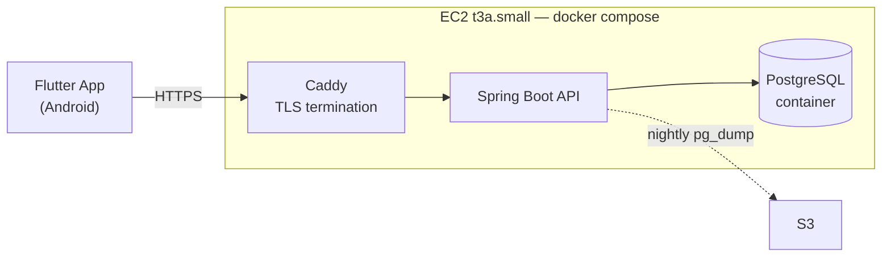
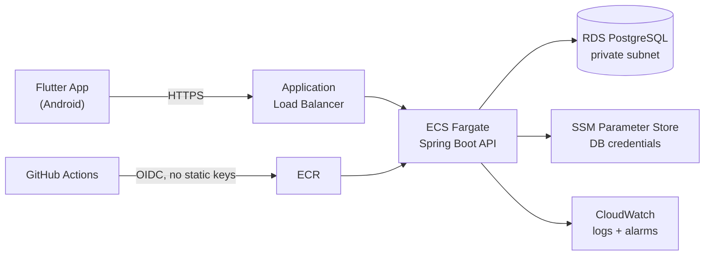

# PapaPreco — Engineering Roadmap

This document tracks the evolution of PapaPreco from a working prototype into a
production-deployed system. Each item states **what**, **why**, and a rough
effort estimate, so the reasoning behind the ordering is auditable — not just
the outcome.

**Status legend:** `[ ]` todo · `[~]` in progress · `[x]` done · `[-]` deliberately skipped

**Ordering principle:** unblock first → highest-variance work next (unknown
unknowns need slack) → predictable work → presentation last.

---

## Phase 0 — Make it deployable

Blockers. Nothing downstream can start until these are done.

- [x] **Externalize API configuration** — ~2h
  Replaced the `Configs.status` enum and hardcoded LAN IPs in `lib/rest/api.dart`
  with a single `--dart-define=API_BASE_URL=...`, which carries the scheme and
  the API's context path so pointing at an HTTPS deployment is a build argument
  rather than a code change. `API.uri(path, [query])` is now the only way call
  sites build a URL. The `pc`/`cel` branches went away with the enum: the QR
  pre-fill became `--dart-define=DEV_QRCODE_URL`, and `MapProvider` now falls
  back to the default coordinates whenever geolocation is unavailable instead of
  asking which machine it is running on.
  *Why:* a home-network IP committed to source control is the least defensible
  file in the repository, and no deploy is possible while the base URL is fixed
  at compile time.

- [x] **Delete or rewrite `test/widget_test.dart`** — ~15min
  The file contained the Flutter counter template and asserted on widgets that
  did not exist. Deleted, and replaced with `test/rest/api_test.dart` covering
  URL resolution and query/path escaping — `flutter test` would otherwise fail
  on an empty suite.
  *Why:* a red test suite is strictly worse than no test suite.

- [x] **Rotate the API's committed credentials and externalize its config** — ~3h
  Not in the original plan; found while starting the Docker work. Three live
  secrets were committed to `papaprecoapi`, which is a public repository: the
  Gmail app password in `application.yaml`, the RSA private key signing every
  JWT, and a `firebase-adminsdk` **service account** key — a server-side admin
  credential for the whole Firebase project, which is a different thing from
  the `google-services.json` client config discussed in Phase 4. All three were
  rotated and the old ones revoked at the provider, then moved to a gitignored
  `secrets/` directory and read through `${...}` placeholders; `.env.example`
  documents the variable list. `SecurityConfig` was reading its keys via
  `@Value("jwt.rsa.pub")` with no `${}`, so the JWT properties in
  `application.yaml` were dead config and no override could have worked. Log
  levels dropped from `TRACE` to `INFO` defaults — `BasicBinder: TRACE` prints
  bound SQL parameters, meaning password hashes and verification codes.
  *Why:* rotation is the only real fix once a secret is pushed, and the roadmap
  already ruled history rewriting out of scope. Nothing could be deployed
  before this: an image built from the old tree would have baked the keys into
  a layer, and there was no way to supply a different database or mail account
  per environment.

- [x] **Dockerize the API** — ~3h
  Multi-stage build, slim JRE base, non-root user, `HEALTHCHECK` instruction.
  The Phase 1 instance is x86_64, the same architecture as the development
  machines, so the image built locally is the image that runs on the server.
  Dependencies resolve in their own layer, ahead of `COPY src/`, so editing a
  source file does not re-resolve the dependency tree. The runtime stage runs as
  uid 1000 — not an arbitrary choice: the credential files are bind-mounted from
  the host at `0600`, so the container user has to *be* their owner, and 1000 is
  the first non-root account on developer machines, `ec2-user` and `ubuntu`
  alike. The JVM is given `-XX:MaxRAMPercentage` rather than a fixed `-Xmx`, or
  it sizes its heap against the whole machine and gets OOM-killed next to
  PostgreSQL on a 2 GB instance.
  *Why:* the image is the deploy artifact, and it is what makes the build
  reproducible instead of depending on whichever JDK happens to be installed.

- [x] **`docker-compose.yml`, for local development and for the deploy** — ~1h
  API + PostgreSQL, seeded, one command to start: 16 seconds from an empty
  volume to an API answering ranking queries. `spring-boot-starter-actuator` was
  added and `/actuator/health` put on the `permitAll` list — without that it
  answers 401 and the container never reports healthy. Only `health` is exposed;
  the other actuator endpoints publish the environment and the datasource
  configuration and stay authenticated. Actuator's mail health indicator is
  disabled: it opens an authenticated SMTP connection to Gmail on every probe
  and reports the whole application DOWN when that fails, which would make
  container restarts depend on a third party with nothing to do with serving
  product queries.
  The API waits on `condition: service_healthy` rather than the default
  `service_started`, because PostgreSQL accepts TCP connections for a while
  before it will answer a query and Flyway runs during startup. Both services
  publish on `127.0.0.1` only, so a security group that is too wide is not by
  itself enough to expose the database.
  **Caddy is deliberately not in the file yet.** Let's Encrypt has nothing to
  validate without a domain pointed at the instance, so it arrives with the
  Phase 1 item that has that prerequisite, rather than as a stub that cannot
  work.
  *Why:* a reviewer who cannot run the project will not evaluate the project.
  This is also the file Phase 1 deploys — the same stack runs locally and on the
  instance, which is most of the argument for containerising in the first place.

- [x] **Versioned database migrations (Flyway)** — ~2h
  Flyway over Liquibase: the migrations are PostgreSQL-specific either way —
  `pg_trgm`, a plpgsql function, two views — so Liquibase's database-agnostic
  changelog format would have bought abstraction that this schema cannot use,
  in exchange for a second dialect to learn on top of SQL.
  `V1__baseline_schema.sql` is `outros/banco.sql` turned into a migration, and
  is deliberately a translation rather than a redesign. Four things had to
  change, because the original could not run start to finish: `pg_trgm` was
  created twice, the second time without `IF NOT EXISTS`; an index was declared
  on `produto (nome, latitude, longitude)`, but those coordinates are columns of
  `localizacao` and that statement always failed; `fuzzystrmatch` was created
  and never used; and the `INSERT`s were interleaved with the DDL.
  Demo rows are not schema, so they moved to `db/seed`, a second Flyway location
  that is not on the default list and has to be opted into by `FLYWAY_LOCATIONS`
  — local development does, a deployed environment does not. That is what makes
  it safe for the seeded accounts to carry a published password.
  `baseline-on-migrate` is on, so a database built by hand before any of this
  existed is stamped as already at `V1` and picks up `V2` onwards instead of
  failing on a `CREATE TABLE` for a table that is already there.
  *Why:* schema-as-code is assumed at senior level; hand-applied DDL is not.

- [x] **Make the Firebase service account key optional** — ~1h
  Not in the original plan; found while verifying the compose file. The
  `FirebaseMessaging` bean read `firebase.credentials.location` eagerly at
  startup, so a checkout without a real `secrets/firebase-service-account.json`
  failed to boot — and a service account key cannot be committed, generated
  locally, or handed to a stranger the way an RSA keypair can. Push
  notifications are one optional feature; they were a hard prerequisite for the
  whole API.
  The bean moved out of `PapaprecoapiApplication` into `config/FirebaseConfig`
  and now returns null when the key is absent, logging what is disabled and how
  to enable it. `FirebaseMessagingService` injects it with `required = false`
  and reports `isEnabled()`; a missing key is a WARN, a key that exists but
  cannot be parsed is an ERROR, and neither stops the application. The alert
  sweep returns before running its query rather than after, and
  `/notification/trigger-manual` answers 503 instead of `200 "enviadas!"` on an
  instance that sent nothing.
  Verified three ways: no key at all (starts, search and authentication work,
  notifications report disabled), a malformed key (starts, logs ERROR), and the
  real key (unchanged).
  *Why:* item 2 of the definition of done below says a reviewer can clone the
  repository and run `docker compose up`. Before this they could not, and the
  failure was at startup rather than at the point they tried to use
  notifications.

---

## Phase 1 — Get it on AWS

The goal of this phase is narrow and concrete: **a stranger can install the APK
and use the app, without running anything themselves.** It is not about
architecture. It is about being reachable.

This phase was originally written as Terraform → ECS Fargate → ALB → RDS. It
was rewritten for two reasons, both worth recording:

1. **Terraform does not teach AWS.** It is a way to *describe* AWS to a
   machine. Writing it before having seen a security group means debugging two
   unfamiliar things at once, and when a task fails to start there is no way to
   tell whether the fault is in the networking, the task definition, the IAM
   role, the image, or the Terraform itself. Build it by hand, then codify what
   is already understood. That order is also the only one in which the argument
   *for* infrastructure-as-code stops being abstract.
2. **Cost.** The Fargate target is ~USD 55/month once the task is sized to
   actually hold this application and the load balancer's public IPv4 addresses
   are counted — see the corrected table below. The single-instance equivalent
   is ~USD 20, now measured rather than estimated. The difference buys nothing
   the current goal needs.

None of this is throwaway work. VPCs, subnets, security groups, IAM, EBS and
DNS are the same primitives Fargate sits on top of; the migration path is
recorded at the end of this phase.

Target architecture:

- [x] **AWS Budget alarm at USD 20 — before creating any other resource** — ~15min
  A monthly cost budget, deliberately unfiltered so it covers every service in
  every region, alerting at 85% actual, 100% actual and 100% forecasted. Created
  while the account still held nothing.
  Worth being precise about what it is: a smoke detector, not a sprinkler. It
  sends email and stops nothing, and AWS has no hard spending cap of any kind.
  Cost data also lands in the billing pipeline 8–24 hours behind reality and
  budgets evaluate roughly three times a day, so an alert can arrive a day after
  the spend that triggered it — irrelevant at ~USD 0.65/day, and precisely the
  point if something runaway ever starts. The forecast threshold stays quiet for
  the first month or two; forecasting needs history before it can predict.
  *Why:* the single cheapest insurance policy in this document.

- [x] **Launch the EC2 instance by hand, from the console** — ~2h
  **us-east-2 (Ohio), t3a.small, Amazon Linux 2023 x86_64, 20 GiB gp3**, one
  security group allowing 80 and 443 from anywhere and 22 from a single address.
  Docker, Compose, `docker compose up`, and the API answering `200 {"status":
  "UP"}` on the instance's public address.
  *Why:* this is the phase's actual learning content. Regions, AMIs, instance
  types, key pairs, security groups and EBS all get encountered here, one at a
  time, in a console that explains what it is asking for.

  What the console asked that this document had not anticipated:

  - **Region is the largest cost lever in the phase, and it is chosen before
    anything else exists.** sa-east-1 (São Paulo) is AWS's most expensive
    region — on the order of 55–60% above the cheap US regions for the same
    instance, which by itself puts this phase over its own budget. The pull the
    other way is ~130 ms of latency from Brazil, imperceptible against an HTTP
    API whose slowest path is SEFAZ scraping in Brazil regardless. Ohio, not
    São Paulo.
  - **t3a rather than t3.** AMD EPYC instead of Intel, ~10% cheaper, still
    x86_64 — so nothing about the "images built locally run on the server
    unchanged" argument changes. Marginally slower single-thread, which nothing
    here notices.
  - **Amazon Linux 2023 does not ship the Compose v2 plugin.** `dnf install
    docker` gives the daemon and the CLI; `docker compose` then answers
    `'compose' is not a docker command`. Installed by hand into
    `/usr/local/lib/docker/cli-plugins`, pinned to a version rather than
    `latest` so a rebuild months from now behaves the same.
  - **2 GiB has no swap by default, and needs some.** `javac` compiling this
    application next to a running PostgreSQL is close enough to the limit that
    the OOM killer resolves it by shooting the JVM, which presents as a build
    that stops mid-compile with no error. A 2 GiB swapfile in `/etc/fstab` is
    slow but it is the difference between slow and dead.
  - **The uid-1000 decision from Phase 0 paid off exactly as intended.**
    `ec2-user` on AL2023 *is* uid 1000, so the bind-mounted `0600` credentials
    are readable by the container's `app` user with nothing chowned on either
    side.
  - **The Dockerfile's `MaxRAMPercentage` had no limit to follow.** It sizes the
    heap against the *container's* memory limit, and `docker-compose.yml` sets
    none — so on a 2 GiB box the container's limit is the whole machine and the
    JVM claims ~1.5 GiB, which is the exact failure the flag was chosen to
    prevent. Corrected on the instance with an untracked
    `docker-compose.override.yml` setting `mem_limit: 1g` on `api` and `512m` on
    `db`. **Open decision:** whether that belongs in the committed compose file
    instead. It probably does — the limits are correct on a laptop too, and
    host-specific tuning that exists only on the host is the thing containers
    were supposed to stop.
  - **Verifying "answers on the public address" required opening a port on
    purpose.** Both compose services bind to `127.0.0.1`, correctly, so nothing
    is reachable from outside as shipped. Published on 80 briefly, confirmed
    from a laptop, and reverted. An SSH local forward would have proved the API
    works while proving nothing at all about the security group, and the
    security group is half of what this item exists to teach.

  The public IPv4 is auto-assigned and therefore changes on every stop/start,
  which is what the next item fixes.

- [x] **Permit `/error` in `SecurityConfig`** — ~30min
  Not in the original plan; a known defect that had been deferred, fixed here
  because this is the phase where it does the most damage. The servlet container
  re-dispatches any failed request to `/error` to render the response body, and
  that dispatch runs through the security filter chain again — so with `/error`
  falling through to `anyRequest().authenticated()`, the status reaching the
  client described the error page's access rules rather than the original fault.
  Measured against the running stack, this was broader than the "404s and 500s"
  it had been filed as: an ordinary validation `400` on a `permitAll` endpoint
  came back `401` with a `WWW-Authenticate` header too. Every bug in the system
  presented as broken authentication.
  Permitting it leaks nothing — `server.error.include-message` and
  `include-stacktrace` both default to `never`, so the body is timestamp,
  status, error and path.
  One case is not this bug and did not change: a request to a path outside every
  `permitAll` prefix still answers `401`, because Spring Security has no rule for
  it and cannot know it is unmapped. Inherent, and the only way to change it
  would be to disclose which paths exist.
  *Why:* the first hour on a new instance is spent curling unfamiliar URLs and
  reading status codes. Deferring this costs more in that hour than anywhere
  else in the project — demonstrated live, in fact: the first `404` attempted
  against the deployed API came back `401`, because the instance had cloned the
  branch before the fix landed on it.

- [ ] **Domain and DNS** — ~1h
  Register a domain, allocate an Elastic IP, point an A record at it.
  *Why:* an Elastic IP survives a stop/start and the default public address
  does not. TLS needs a real name, so this blocks the next item.

- [ ] **Caddy in front, for HTTPS** — ~1h
  Added to the compose file as a reverse proxy. Automatic Let's Encrypt
  certificates, automatic renewal, a three-line Caddyfile.
  *Why:* it replaces the ALB at USD 0 rather than ~USD 17/month. It is also a
  hard requirement rather than polish: Android has blocked cleartext HTTP by
  default since API 28, so the app cannot reach an `http://` API on any current
  phone.

- [ ] **Nightly `pg_dump` to S3** — ~1h
  Cron on the instance, with a lifecycle rule expiring objects after 30 days.
  *Why:* PostgreSQL in a container on the application's own instance has no
  managed backups and no failover. That is the trade being made in exchange for
  not paying for RDS yet, and it should be a deliberate one rather than an
  oversight discovered later.

- [ ] **Ship a signed release APK** — ~3h
  The distributable build is its own chain of prerequisites, none of which are
  visible when running from an IDE:
  1. Generate a release keystore. `android/.gitignore` already covers `*.jks`
     and `key.properties`; the password belongs in `key.properties`, never in
     `build.gradle`.
  2. Wire `signingConfigs.release` into `android/app/build.gradle`. Both
     `signingConfig` lines are currently commented out, so release builds are
     signed with the debug key. While there, delete the commented-out block
     above them — it carries a plaintext keystore password for a keystore that
     is not in the repository.
  3. Register the release key's SHA-1 fingerprint in the Firebase console.
     **Google Sign-In fails on every installed APK if this is skipped**, while
     continuing to work on the development machine.
  4. Build with `--dart-define=API_BASE_URL=https://<domain>/papaprecoapi`.
  5. Publish to GitHub Releases.
  *Why:* this is the item the entire phase exists to reach. It is also the one
  with the most ways to look finished while being broken for everyone except
  the person who built it.

### Cost

Revised against what was actually launched — us-east-2, t3a.small — rather than
against the estimate this document carried before. On-demand list prices; the
launch wizard shows the live hourly rate per instance type and is the
authoritative source.

| Resource | Monthly | Note |
|---|---|---|
| EC2 t3a.small (2 GB) | ~USD 13.70 | USD 0.0188/hr × 730. t3.small is the Intel equivalent at ~USD 15. t3.micro is ~USD 8, but 1 GB is tight with PostgreSQL alongside |
| EBS gp3, 20 GB | ~USD 1.60 | USD 0.08/GB-month. Billed while the instance is stopped, too |
| Public IPv4 | ~USD 3.65 | USD 0.005/hr on every public address, since Feb 2024 |
| **Running, before a domain** | **~USD 19** | Where the account stands today |
| Route 53 hosted zone | ~USD 0.50 | Plus ~USD 12/year for the domain |
| S3 (backups) | <USD 1 | |
| **Total** | **~USD 20.50** | Stop the instance when not in use: ~USD 1.60/month for the volume alone |

Note the collision this creates with the item above: **a USD 20 budget alarm
will trip in any full month the instance is left running**, at 85% around day
25 and at 100% on the last day or two. That is not a miscalibration — it is a
smoke detector set just above steady state, which is the correct place for one —
but the first alert should be recognised as arithmetic rather than as news. The
alternative is not a higher threshold, it is the line above: the instance does
not need to run 24/7 during a phase where nobody is using it yet.

The free tier is not a plan. Accounts created after 15 July 2025 get USD 100–200
in credits expiring after six months, not the old 12-month allowance — check
which model the account is on before relying on it.

### Next AWS steps, once it is live

Deliberately sequenced after the app is publicly working. Each one is a single
new primitive, learned against a system that already runs.

- [ ] **Move PostgreSQL to RDS** — ~3h, +~USD 14/month
  *Why:* teaches subnet groups, security groups between two resources, and
  managed backups. The best next primitive to add — but not on day one, where
  it would be one more unfamiliar thing standing between the code and a working
  URL.
- [ ] **Terraform: instance, security group, Elastic IP, DNS** — ~5h
  *Why:* codifying something already built and understood. Destroy it, bring it
  back with `terraform apply`, and the value of infrastructure-as-code is
  demonstrated rather than asserted.
- [ ] **Publish the Terraform in a public `papapreco-infra` repository** — ~1h
  *Why:* infrastructure-as-code is what recruiters actually search for.
- [ ] **GitHub Actions: build the image, deploy over SSH** — ~3h
  *Why:* deployment is manual until this exists.

### Where this goes later — the Fargate target

Not scheduled. Recorded because the reasoning still holds and this is where the
system should end up once the budget allows, or once the single instance starts
being the constraint.

Fargate tasks would run in **public subnets** with a restrictive security
group: a NAT Gateway costs ~USD 32/month and buys nothing at this scale. That
remains a deliberate cost/security trade-off — see the corresponding ADR.
Credentials would move to SSM Parameter Store, which is cheaper than Secrets
Manager and sufficient without rotation needs, and GitHub Actions would reach
AWS via OIDC rather than long-lived access keys in repository secrets.

Corrected cost, replacing the ~USD 25–30 estimate this document carried before:

| Resource | Monthly | Note |
|---|---|---|
| NAT Gateway | ~USD 32 | **Avoided by design** |
| ALB | ~USD 17 | |
| ALB public IPv4 (2 AZ) | ~USD 7 | Missing from the original estimate |
| Fargate | ~USD 18 | 0.5 vCPU / 1 GB. The original 0.25/0.5 estimate will not hold this application with `firebase-admin` and JPA loaded |
| RDS t4g.micro | ~USD 14 | The original estimate assumed a free tier this account may not have |
| **Total** | **~USD 56** | Roughly triple the single-instance setup |

---

## Phase 2 — CI and tests

Predictable, low-variance work. Expands or contracts to fill remaining time.

- [ ] **GitHub Actions on both repositories** — ~4h
  `analyze` + `test` + `build`, enforced as a required check on pull requests.

- [ ] **API: JUnit + Testcontainers against real PostgreSQL** — ~6h
  *Why:* testing repositories against a real database instead of mocks is a
  strong seniority signal and catches the bugs mocks hide.

- [ ] **Flutter: unit tests for the NFC-e parser and repositories** — ~6h
  *Why:* the NFC-e parser is the most complex and highest-risk logic in the
  codebase. Coverage percentage is not the goal — covering the hard parts is.

- [ ] **Widget tests for 3–4 critical screens** — ~4h

- [ ] **Selective refactor for testability (2–3 files maximum)** — ~4h
  Extract logic out of `detalhe_produto_page.dart` (590 lines) and
  `alertas_usuario_page.dart` (470 lines) only where it unlocks a test.
  *Why:* refactoring for aesthetics alone is not worth the time right now.

---

## Phase 3 — Presentation

- [ ] **Rewrite README in English** — ~3h
  30-second demo GIF, Mermaid architecture diagram, live demo link, CI badges.

- [ ] **Architecture Decision Records in `docs/adr/`** — ~3h
  Minimum set:
  1. Why Flutter over native
  2. Why a single EC2 instance over ECS Fargate — cost, and building by hand
     before codifying in Terraform
  3. PostgreSQL in a container over RDS, and the backup trade it carries
  4. Public subnets over NAT Gateway (cost/security trade-off), for when the
     Fargate target arrives
  5. Portuguese domain terms as ubiquitous language, English everywhere else
  *Why:* seniority is assessed on documented trade-offs, not on technology
  choices. Highest signal-per-hour item in this roadmap.

- [ ] **Distributable demo** — ~3h
  APK on GitHub Releases + short video. Recruiters do not install APKs; the
  video is what actually gets watched.

- [ ] **Conventional commits in English from this point forward** — ongoing
- [-] **Rewrite existing git history** — *skipped:* cost outweighs benefit.

---

## Phase 4 — Differentiators (post-MVP)

This is what separates the project from every other CRUD-on-AWS portfolio. Not
part of the initial sprint.

- [ ] **Asynchronous NFC-e processing via SQS** — ~20h
  App submits the receipt URL → API enqueues to SQS → worker (Lambda, or a
  second container alongside the API) scrapes SEFAZ → persists. With a dead-letter queue, exponential backoff
  and idempotency keys.
  *Why:* scraping a government website is slow and fragile, which is a **real**
  justification for queues, retries and a DLQ — not architectural decoration.
  This is the strongest interview story the project has.

- [ ] **Observability** — ~8h
  Structured JSON logging, end-to-end correlation IDs, `/actuator/health` and
  `/metrics`, a CloudWatch dashboard, alarms on 5xx rate and disk usage.

- [ ] **Security hardening** — ~8h
  Rate limiting, refresh-token rotation, and restricting the Firebase API key in
  the GCP console. Note: `google-services.json` is committed, which is expected
  for a client config shipped inside the APK — but the key must be restricted,
  and the reasoning should be explainable.

- [ ] **Performance** — ~8h
  Proper geospatial indexing (PostGIS or `earthdistance`), pagination on list
  endpoints, `EXPLAIN ANALYZE` on the ranking query.

- [ ] **Flutter Web build on S3 + CloudFront** — ~6h
  Degraded mode (no scanner), but gives recruiters a clickable demo.

---

## Explicitly out of scope

Recorded deliberately — knowing what *not* to build is part of the argument.

| Not doing | Reason |
|---|---|
| EKS / Kubernetes | ~USD 73/month for the control plane alone — four times the entire current setup. Nothing here needs orchestration. |
| Microservices | The domain does not justify it. Would read as over-engineering. |
| Multi-AZ, aggressive auto-scaling | Documented as a scaling strategy in an ADR rather than paid for. |
| 80% test coverage target | Coverage of the hard logic matters; the number does not. |
| Full Portuguese → English code rename | ~60 files of churn. Resolved with an ADR instead. |

---

## MVP definition of done

The sprint is complete when a reviewer can, without assistance:

1. Install the APK from GitHub Releases and use the app against the live API,
   including signing in
2. Clone the repository and run the full stack with `docker compose up`
3. Open a live URL and see a working API
4. See a green CI badge backed by tests that actually assert something
5. Read a README that explains the architecture in under two minutes
6. Read ADRs explaining why the system is built this way and not another way
